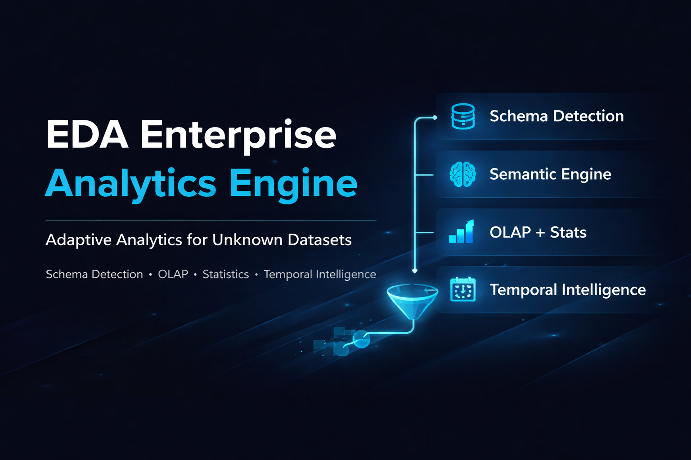
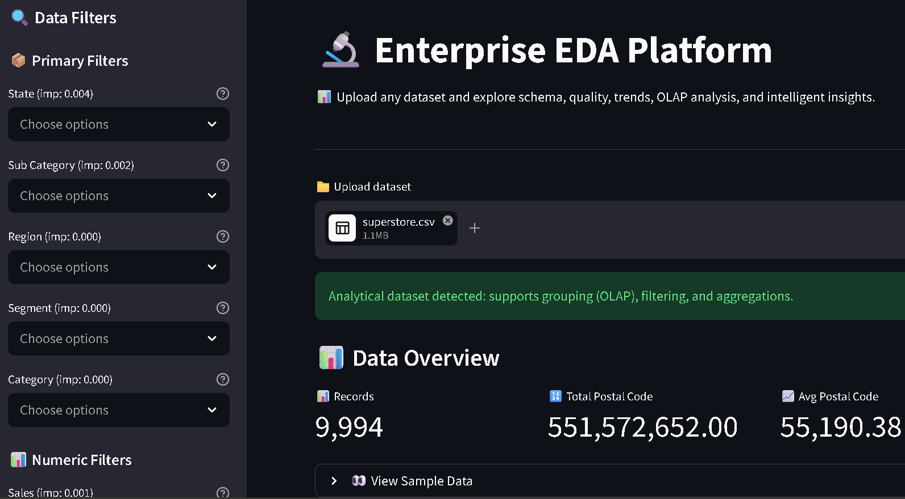
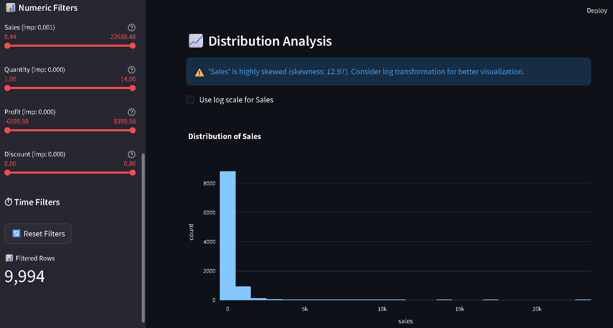
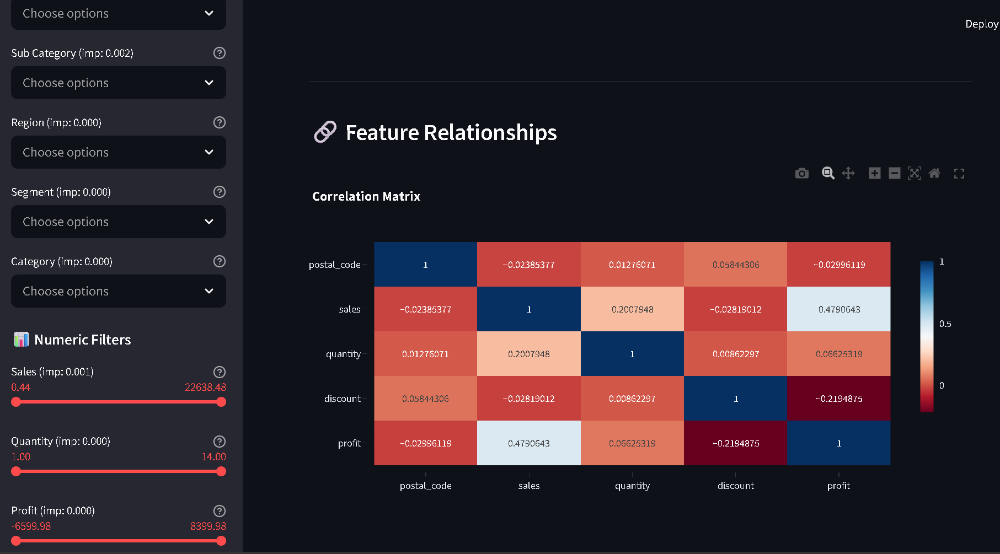
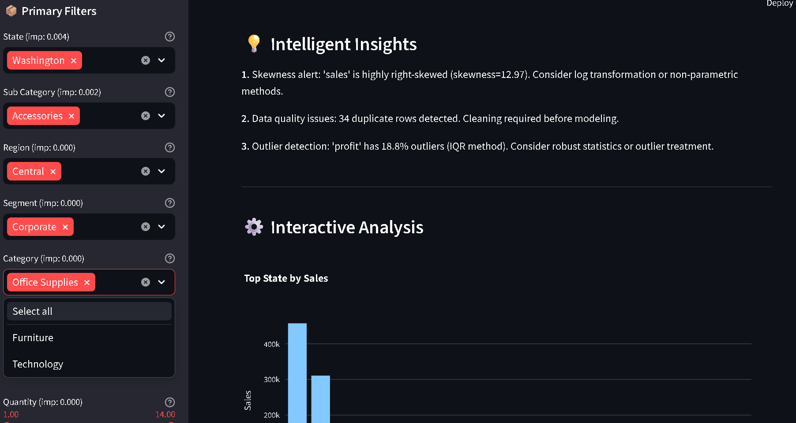

<!-- ===================================================== -->

<!--                    PROJECT BANNER                     -->

<!-- ===================================================== -->
<!-- markdownlint-disable MD033 -->
<!-- markdownlint-disable MD041 -->
<!-- markdownlint-disable MD045 -->
<p align="center">
  
</p>

<h1 align="center">🚀 EDA Enterprise Analytics Engine</h1>

<p align="center">
  <b>Modular • Dataset-Agnostic • Capability-Driven • Production-Ready EDA System</b>
</p>

<p align="center">
  Transform unknown datasets into structured insights using semantic intelligence, statistical analysis, OLAP operations, and adaptive visualization.
</p>

<p align="center">
  
  
  
  
  
</p>

---

# 📌 Overview

Traditional EDA workflows are:

* Notebook-heavy
* Dataset-specific
* Fragile to schema variations

This system introduces a **capability-driven analytics engine** that:

* Automatically detects schema
* Understands column semantics
* Adapts execution dynamically
* Generates insights without manual intervention

---

# ⚙️ Key Features

| Category        | Capability                                                                  |
| --------------- | --------------------------------------------------------------------------- |
| 🧠 Intelligence | Semantic column classification (metrics, dimensions, identifiers, temporal) |
| 🔍 Statistics   | Mean, median, std, skewness, kurtosis                                       |
| 📦 Outliers     | IQR-based detection                                                         |
| 🧊 OLAP         | Slice, dice, roll-up, drill-down, pivot                                     |
| 📈 Temporal     | Trends, resampling, rolling averages                                        |
| 🎛️ UI           | Adaptive filter system                                                      |
| 💡 Insights     | Automated insight generation                                                |
| 🛡️ Robustness   | Fail-safe execution (no crashes)                                            |

---

# 🧱 Architecture

```plaintext
Raw Dataset
     ↓
Preprocessing (cleaning, type handling)
     ↓
Schema Detection
     ↓
Semantic Classification
     ↓
Capability Engine (decides WHAT can run)
     ↓
Statistical + OLAP + Temporal Analysis
     ↓
Insight Generation
     ↓
Interactive Dashboard (Streamlit)
```

---

## 🔥 Design Principles

* **Modular Architecture** → Independent components
* **Separation of Concerns** → UI ≠ logic ≠ analytics
* **Capability-Driven Execution** → No hardcoded assumptions
* **Graceful Degradation** → Missing features don’t break system

---

# 📁 Project Structure

```plaintext
app/
  dashboard.py     → Streamlit UI (visual + interaction)
  app.py           → CLI entry point

src/
  preprocessing.py → Cleaning, type handling, missing values
  schema.py        → Column detection & classification
  schema_config.py → Detection rules
  stats.py         → Descriptive stats + IQR outliers
  olap.py          → Groupby, pivot, aggregation
  temporal.py      → Time-series analysis
  pipeline.py      → Orchestration engine

data/
  > ⚠️ Place your dataset inside `data/` directory before running
  superstore.csv   → Sample dataset
```

---

# ▶️ Usage

## 🧪 CLI Mode

```bash
python app/app.py data/superstore.csv
```

---

## 🌐 Dashboard Mode

```bash
streamlit run app/dashboard.py
```

---

# 🧠 Example Capabilities

| Dataset Type             | System Behavior                |
| ------------------------ | ------------------------------ |
| Retail dataset           | OLAP + correlation + trends    |
| Feature dataset          | Distribution + skew + outliers |
| No datetime              | Temporal skipped safely        |
| High-cardinality columns | Auto-excluded as identifiers   |
| No categorical columns   | OLAP disabled                  |

---

# 🔍 Sample Insights

* 📊 Skewness → Suggests log transformation
* ⚠️ Outliers → Detected via IQR
* 🔗 Correlation → Feature relationships
* 🆔 Identifier detection → Removed from analysis

---

# 🧠 Key Engineering Decisions

## 1. Capability-Driven System

Instead of assuming dataset type:

* Detects what is possible
* Executes only valid analyses

---

### 2. Identifier Filtering

* High-cardinality columns excluded
* Prevents misleading analytics

---

### 3. Dominance Filtering

* Constant / near-constant columns ignored
* Improves signal quality

---

### 4. Fail-Safe Pipeline

| Scenario       | Behavior      |
| -------------- | ------------- |
| No datetime    | Skip temporal |
| No numeric     | Skip stats    |
| No categorical | Skip OLAP     |

---

# 🧪 Exam-Ready Patterns

```python
pd.to_numeric(..., errors='coerce')
pd.to_datetime(..., errors='coerce', infer_datetime_format=True)
df.groupby(...).agg(...)
pd.pivot_table(...)
df.rolling().mean()
```

---

# 📊 Tech Stack

* Python
* Pandas
* NumPy
* Streamlit
* Plotly

---

# 📸 Screenshots

## Dashboard Overview



## Distribution Analysis



## Correlation Matrix



## Insights



---

# 🛠️ Installation

```bash
git clone https://github.com/Shuchi-Anush/eda-enterprise-analytics-engine.git
cd eda-enterprise-analytics-engine

python -m venv venv
venv\Scripts\activate

pip install -r requirements.txt
```

---

# 🚀 Future Enhancements

* Auto visualization planner
* ML-based feature importance
* Real-time streaming analytics
* Docker + cloud deployment

---

# 📄 License

This project is licensed under the **MIT License**.

---

# 🎯 Final Note

This is not just an EDA dashboard.

It is a **data analytics engine** that:

* Understands data
* Adapts automatically
* Generates meaningful insights

---

<p align="center">
  ⭐ If you find this useful, consider starring the repository!
</p>
